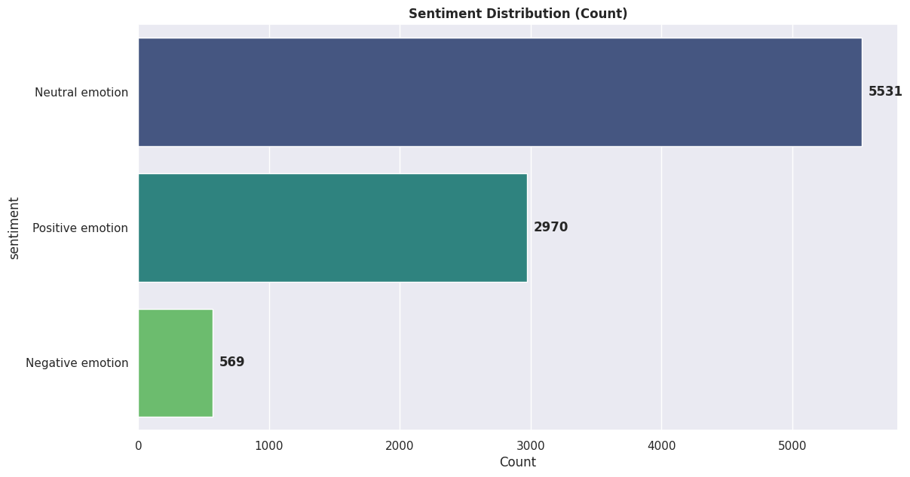
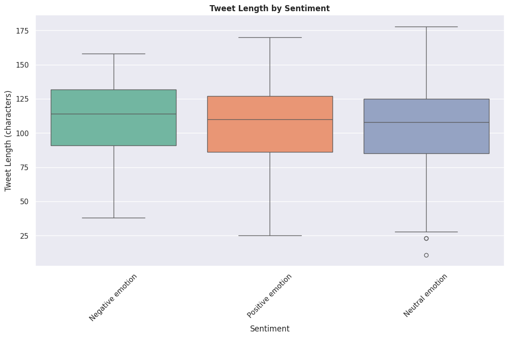
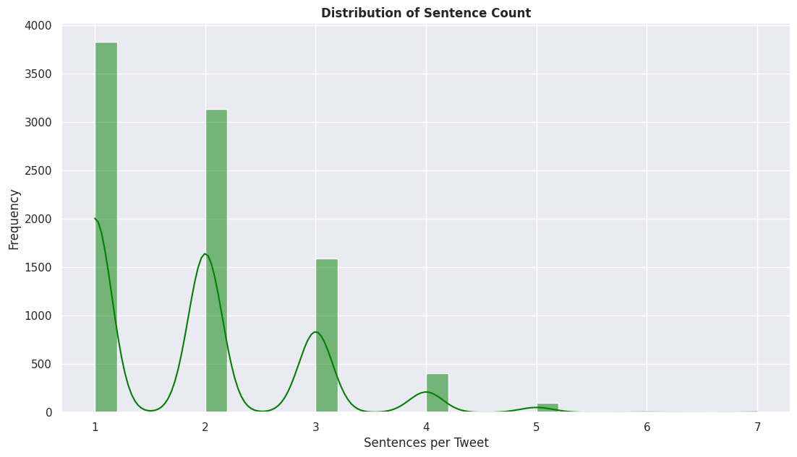

# Twitter Sentiment Analysis (Natural Language Processing)

## Project Summary
This project uses Natural Language Processing (NLP) techniques to classify tweets related to Apple and Google. It does this by accomplishing these tasks:
- Predict whether a tweet refers to an Apple or Google product.
- Predict whether a tweet expresses a Negative, Neutral, or Positive sentiment.
Built with libraries such as scikit-learn and NLTK, the project includes a complete machine learning pipeline from data preprocessing to model deployment.

## Data Understanding
The dataset used is tweet_product_company.csv, which contains real-world tweet data mentioning Apple and Google products. Each entry includes the tweet text, the referenced product (e.g., iPhone, Google), the associated company (Apple or Google), and a sentiment label (positive, negative, or neutral). It supports both binary and multiclass sentiment prediction and offers real-world variability, including emoji usage, slang, and abbreviations.
We will explore the dataset to understand the kind of information it contains, the different features and their data types, as well as checking for things like missing values or unusual patterns. This will help us get a clear picture of the data before moving on to cleaning, preprocessing and vectorization.

## Problem Statement
Apple and Google, two of the world's leading tech companies, heavily depend on public perception to maintain their market positions and customer trust. As consumers increasingly voice their opinions on platforms like Twitter, understanding these sentiments has become very paramount for brand management, product development, and customer engagement strategies. This has therefore led to the need to develop algorithms that can provide sentiments for various opinions from users.

## Business Objectives
The primary client for this NLP project is Apple and Google. By analyzing sentiments from tweets about their products and those of their competitors, these tech giants can gain authentic feedback that traditional methods might miss. This real-time access to customer sentiment will enable them to quickly identify trends, preferences, and potential issues, facilitating proactive engagement and timely adjustments to their strategies.

## Project Objectives:
1. To apply text preprocessing and vectorization techniques to prepare the Twitter data for effective model training.
2. To develop a binary sentiment classifier to distinguish between positive and negative tweets, as a baseline.

3. To extend the model to a multiclass classifier, that includes the neutral class.

4. To evaluate classifier performance using appropriate metrics such as F1-score, precision and recall, particularly for imbalanced classes.

5. To provide actionable, data-driven insights and recommendations that 
will guide these tech companies in leveraging sentiment analysis for 
future product developments. 

## Exploratory Data Analysis
We performed a systematic investigation of the dataset to extract insights, evaluate feature distributions, assess the relationship between the feature and target variables, and identify anomalies, outliers or data quality issues. This was helpful in choosing the right modelling techniques.
We also inclued visualizations showing sentiments and distributions as shown below:

### Sentiment Distribution


### Tweet Length by Sentiment


### Sentence Distribution


## Data Cleaning And Preprocessing
We introduced a custom TweetPreprocessor class designed to automate and standardize the text cleaning and feature extraction process for Twitter sentiment analysis. the class performed tasks such as:

**Data Cleaning**:

- Removal of URLs, user mentions, hashtags, special characters, and repeated characters.

- Expansion of common English contractions (e.g., "can't" → "cannot").

- Normalization of whitespace and punctuation.

**Text Preprocessing**:

- Conversion to lowercase for consistency.

- Tokenization of text into words.

- Removal of stopwords and short words.

- Lemmatization to reduce words to their base forms.

**Feature Extraction**:

- Supports both TF-IDF and Count Vectorization for transforming cleaned tweets into numerical feature vectors.

- Configurable options for n-gram range, vocabulary size, and document frequency thresholds.

**Pipeline Integration**:

The class is compatible with `scikit-learn` and `imblearn` pipelines, enabling seamless integration with machine learning workflows.


## Modelling
The initial focus is on binary classification, distinguishing between positive and negative sentiments, with neutral tweets excluded from the training set. The pipelines were defined and the model was trained and evaluated using the key metrics of:
- Accuracy: Measures the proportion of correctly classified tweets.

- Precision: Indicates the proportion of true positive predictions among all positive predictions.

- Recall: Reflects the proportion of actual positive tweets correctly identified.

- F1-Score: The harmonic mean of precision and recall, providing a balanced measure of model performance
 
From the above metrics, it was evident that the Naive Bayes model's simplicity and probabilistic nature make it well-suited for text-based sentiment analysis.

Detailed Classification Report:
```
              precision    recall  f1-score   support

    Negative       0.77      0.40      0.53       114
    Positive       0.90      0.98      0.93       594

    accuracy                           0.88       708
   macro avg       0.83      0.69      0.73       708
weighted avg       0.87      0.88      0.87       708

```

On multi-class classification, the goal was to classify tweets into one of three sentiment categories: `Positive`, `Negative`, or `Neutral`. We defined the pipelines, trained the model and evaluated it and we found that the Multi-Support Vector Machine (SVM) model had the highest performance.

Detailed Classification Report:
```
              precision    recall  f1-score   support

    Negative       0.31      0.25      0.28       114
    Positive       0.57      0.52      0.54       594
     Neutral       0.72      0.77      0.75      1106

    accuracy                           0.66      1814
   macro avg       0.54      0.51      0.52      1814
weighted avg       0.65      0.66      0.65      1814

```

## Model Interpretability
LIME (Local Interpretable Model-Agnostic Explanations) was used to explain individual predictions. It basically attempts to understand the model by perusing through the input of data samples, and understanding how the predictions change.

## Conclusion
Binary Classification Performance
The binary classification models (positive vs. negative) achieved strong performance:

- Best Model: Naive Bayes with 87.6% accuracy and 87.2% F1-score
- Consistent Performance: All models achieved F1-scores above 81%, indicating robust sentiment detection capabilities
- Effective Class Balance: SMOTE oversampling successfully addressed the class imbalance issue.

Multi-Class Classification Challenges
The extension to three-class classification (positive, negative, neutral) revealed significant challenges:

- Reduced Performance: Best model (SVM) achieved only 65.7% accuracy and 65.1% F1-score
- Class Imbalance Impact: The dominance of neutral tweets (60.98%) created prediction bias
- Poor Negative Detection: Negative sentiment recall dropped to only 25% from the classification report, indicating most negative tweets were misclassified

## Recommendations
1. Deploy Binary Models: Implement Naive Bayes for reliable positive/negative sentiment monitoring

2. Continuous Learning: Implement feedback loops to improve model accuracy over time

3. Balanced Sampling: Collect more negative sentiment examples to balance the dataset

4. Ensemble Approaches: Combine binary and multi-class models for hybrid predictions

5. Crisis Detection: Use negative sentiment models for early warning systems

6. Product Feedback: Implement sentiment analysis in product review pipelines

## Next Steps
1. Implement Deep Learning Models: Implement a deep learning model with custom Dense layers for sentiment predictions

2. Leverage Transfer Learning: Utilize pre-trained sentiment models such as distilBERT or roBERTa for improved performance

3. Feature Engineering: Incorporate emoji analysis and user metadata for an enriched dataset

4. Model Deployment: Deploy the binary saved model using FastAPI, Streamlit, or Gradio for real-time sentiment feedback